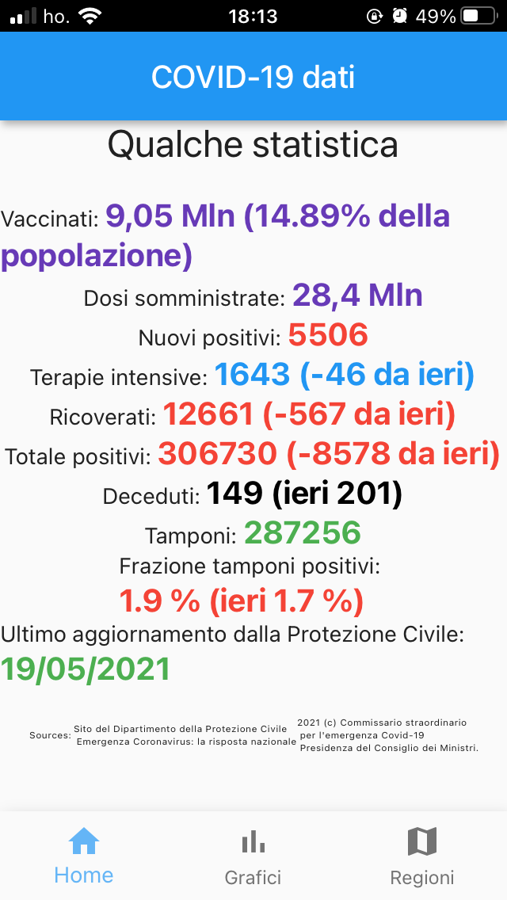

# covid_stats

A new Flutter project to monitor COVID-19 in Italy.

## Web version

a web version is deployed at [https://covidstats.codemagic.app/](https://covidstats.codemagic.app/#/)

## Getting Started

